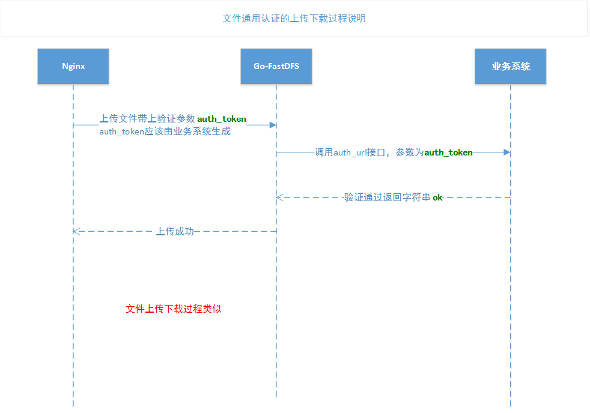
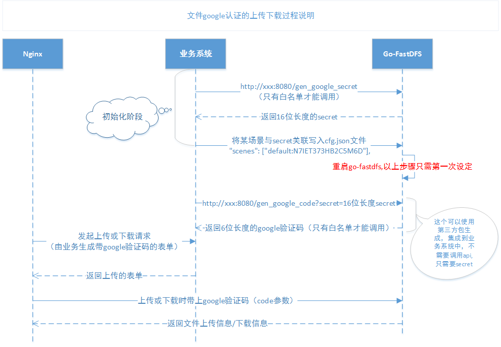

# [中文](README.md) [English](README-en.md)
## Vision: Provide users with the most simple, reliable and efficient distributed file system.


# go-fastdfs is a distributed file system based on http protocol. It is based on the design concept of avenue to simple. All the simple design makes its operation and expansion more simple. It has high performance, high reliability and no center. , maintenance-free and so on.

### Everyone is worried about such a simple file system. Is it not reliable, can it be used in a production environment? The answer is yes, it is efficient because it is simple, and it is stable because it is simple. If you are worried about the function, then run the unit test, if you are worried about the performance, then run the stress test, the project comes with it, run more confident ^_^.

Note: Please read this article carefully before using it, especially [wiki](https://github.com/sjqzhang/go-fastdfs/wiki)

- Support curl command upload
- Support browser upload
- Support HTTP download
- Support multi-machine automatic synchronization
- Support breakpoint download
- Support configuration automatic generation
- Support small file automatic merge (reduce inode occupancy)
- Support for second pass
- Support for cross-domain access
- Support one-click migration
- Support for parallel experience
- Support for breakpoint resuming ([tus](https://tus.io/))
- Support for docker deployment
- Support self-monitoring alarm
- Support image zoom
- Support google authentication code
- Support for custom authentication
- Support cluster file information viewing
- Use the universal HTTP protocol
- No need for a dedicated client (support wget, curl, etc.)
- class fastdfs
- High performance (using leveldb as a kv library)
- High reliability (design is extremely simple, using mature components)
- No center design (all nodes can read and write at the same time)

# advantage

- No dependencies (single file)
- Automatic synchronization
- Failure automatic repair
- Convenient maintenance by talent directory
- Support different scenarios
- Automatic file deduplication
- Support for directory customization
- Support to retain the original file name
- Support for automatic generation of unique file names
- Support browser upload
- Support for viewing cluster file information
- Support cluster monitoring email alarm
- Support small file automatic merge (reduce inode occupancy)
- Support for second pass
- Support image zoom
- Support google authentication code
- Support for custom authentication
- Support for cross-domain access
- Very low resource overhead
- Support for breakpoint resuming ([tus](https://tus.io/))
- Support for docker deployment
- Support for one-click migration (migrated from other system file systems)
- Support for parallel experience (parallel experience with existing file system, confirm OK and then one-click migration)
- Support token download token=md5(file_md5+timestamp)
- Easy operation and maintenance, only one role (unlike fastdfs has three roles Tracker Server, Storage Server, Client), the configuration is automatically generated
- Peer-to-peer (simplified operation and maintenance)
- All nodes can read and write simultaneously


[](https://asciinema.org/a/258926)
#Start the server (compiled, [download](https://github.com/sjqzhang/fastdfs/releases) experience)
```
./fileserver
```


#Command upload

`curl -F file=@http-index-fs http://10.1.xx.60:8080/upload`


# WEB upload (browser open)

`http://127.0.0.1:8080`

#Code upload (options see browser upload)
## python
```python
import requests
url = 'http://127.0.0.1:8080/upload'
files = {'file': open('report.xls', 'rb')}
options={'output':'json','path':'','scene':''} #See browser upload options
r = requests.post(url, files=files)
print(r.text)
```
## golang
```go
package main

import (
	"fmt"
	"github.com/astaxie/beego/httplib"
)

func main()  {
	var obj interface{}
	req:=httplib.Post("http://10.1.5.9:8080/upload")
	req.PostFile("file","path/to/file")
	req.Param("output","json")
	req.Param("scene","")
	req.Param("path","")
	req.ToJSON(&obj)
	fmt.Print(obj)
}
````

## java

```xml
<dependency>
	<groupId>cn.hutool</groupId>
	<artifactId>hutool-all</artifactId>
	<version>4.4.3</version>
</dependency>
```

```java
public static void main(String[] args) {
    File file = new File("D:\\git\\2.jpg");
    HashMap<String, Object> paramMap = new HashMap<>();
    paramMap.put("file", file);
    paramMap.put("output","json");
    paramMap.put("path","image");
    paramMap.put("scene","image");
    String result= HttpUtil.post("http://xxxxx:xxxx/upload", paramMap);
    System.out.println(result);
}
```

# Breakpoint resume example
## golang
```go
package main

import (
    "os"
    "fmt"
    "github.com/eventials/go-tus"
)

func main() {
    f, err := os.Open("100m")
    if err != nil {
        panic(err)
    }
    defer f.Close()
    // create the tus client.
    client, err := tus.NewClient("http://10.1.5.9:8080/big/upload/", nil)
    fmt.Println(err)
    // create an upload from a file.
    upload, err := tus.NewUploadFromFile(f)
    fmt.Println(err)
    // create the uploader.
    uploader, err := client.CreateUpload(upload)
    fmt.Println(err)
    // start the uploading process.
   fmt.Println( uploader.Upload())

}
````
[more langue](doc/upload.md)


Universal file authentication timing diagram


File google authentication timing diagram


# Please click [Feedback](https://github.com/sjqzhang/go-fastdfs/issues/new)


 # <span id="qa">Q&A</span>

- Best practice?
```
First, if it is mass storage, do not open the file token authentication function to reduce performance.
Second, try to use the standard upload, upload the business to save the path, and then connect the domain name when the business is used (convenient migration extension, etc.).
Third, if you use breakpoints to continue transmission, you must use the file id to replace the path storage after uploading (how to replace the QA/API document), to reduce performance for subsequent access.
Fourth, try to use physical server deployment, because the main pressure or performance comes from IO
Fifth, the online business should use the nginx+gofastdfs deployment architecture (the equalization algorithm uses ip_hash) to meet the later functional scalability (nginx+lua).
Sixth, the online environment is best not to use container deployment, the container is suitable for testing and functional verification.
Summary: The path of the file saved by the business reduces the conversion of the later access path, and the file access permission is completed by the service, so that the performance is the best and the versatility is strong (can be directly connected to other web servers).

Important reminder: If the small file merge function is enabled, it is impossible to delete small files later.
Upload result description
Please use md5, path, scene field, others are added to be compatible with the old online system, and may be removed in the future.

```

- Is there an API document?
[API documentation] (doc/api.md)

- Is there a management background?
```
Https://github.com/perfree/go-fastdfs-web
```
- Is there any instructions for using the breakpoint upload?
```
Https://github.com/tus
```

- In the WeChat discussion group, everyone asked about the performance of go-fastdfs?
```
Because there are too many people asking, answer here in unison.
The file location of go-fastdfs is different from other distributed systems. Its addressing is directly located without any components, so the approximate time complexity is o(1)[file path location]
There is basically no performance loss. The project also has a pressure test script. You can carry out the pressure test yourself. Don’t discuss the problem too much in the group. People reply to the same question every time.
Everyone will also feel that this group is boring.
```


- Files that have been stored using fastdfs can be migrated to go fastdfs (other migrations can be handled in a similar manner, and the speed experience is similar)?
```
The answer is yes, the problem you are worried about is the path change, go fastdfs considers this for you.
step:
First, download the latest version of go-fastdfs
Second, copy the original fastdfs file directory to the files directory of go-fastdfs (if there are a lot of files, you can reverse it, copy the fileserver, but keep the fileserver directory structure)
Third, set the enable_migrate to true
Note: All files in the files directory will be scanned during the migration process.
Slower, set enable_migrate to false after migration is complete

Note: The directory of go-fastdfs can not be changed, related to the synchronization mechanism, many students in the group, my files directory can not be customized, the answer is no.
As for whether or not I can use the soft link, I have not tested it and can test it myself.

```

- What is a cluster, how to manage multiple clusters with Nginx?
```
1. In go-fastdfs, a cluster is a group.
2, please refer to the deployment diagram
Note: When the support_group_manage parameter in the configuration is set to true, group information is automatically added to all urls.
For example: http://10.1.5.9:8080/group/status
Default: http://10.1.5.9:8080/status
The difference: more group, corresponding to the group parameter in the configuration, so mainly to solve a Nginx reverse proxy multiple groups (cluster)
Please refer to the deployment diagram for details.

```


- How to build a cluster?
```
First, download the compiled executable file (with the latest version)
Second, run the executable file (generate configuration)
Third, modify the configuration
Peers: increase the peer's http address
	an examination:
Host: Is the automatic generation correct?
Peer_id: Is it unique within the cluster?
Fourth, re-run the server
5. Is the verification service OK?
```


- Is it suitable for mass storage?
```
Answer: Suitable for mass storage
```

- How to upload a folder?
```
 DIR=log && ls $DIR |xargs -n 1 -I {} curl -s -F path=$DIR -F file=@$DIR/{} http://10.1.50.90:8080/upload
 The log of the above command is the directory to be uploaded. If the code upload is a simple loop upload, it will be OK.
```

- How to scale the picture?
```
Add width parameter in the download url
For example: http://127.0.0.1:8080/group1/haystack/5/124,0,27344,.jpg?download=0&width=100&height=100
The special explanation is: if you want to scale, please set the width or height to 0.
```

- How to display images directly in the browser?
```
Add the download=0 parameter to the download url.
For example: http://127.0.0.1:8080/group1/haystack/5/124,0,27344,.jpg?download=0
```


- How to implement custom authentication upload and download?
```
First, the use of the 1.2.6 version of the go-fastdfs
Second, set the auth_url parameter (provided by the application)
Third, the application implements the authentication permission interface (that is, the url of the second step), the parameter is auth_toke, ok, the authentication is passed, and the others are not passed.
Fourth, after the certification is passed, you can upload or download
```


- Need to install nginx yet?
```
Go-fastdfs itself is a high-performance web server, you don't need to install nginx when developing or testing.
But go-fastdfs has a single function, such as caching or redirection or other extensions, nginx has mature components
Therefore, it is recommended to add a layer of nginx on the line, and then use nginx+lua to solve the scalability problem.
```

- Can I dynamically load the configuration?
```
Answer: Yes, but update to the latest version
step:
1) Modify the conf/cfg.json file
2) Visit http://10.1.xx.60:8080/reload
3) Note: Every node needs to do the same thing
```


- How to view cluster file information?
```
Http://10.1.xx.60:8080/stat

What should I do if there is a file error?
Please delete the stat.json file in the data directory. Restart the service, please recalculate the number of files automatically.

Or call
Http://10.1.xx.60:8080/repair_stat

```
- How reliable can it be used in a production environment?
```
This project has been used on a large scale in the production environment, such as fear of not meeting
You can stress test its features before use, any
The problem can be directly mentioned
```

- How to run the program in the background?
```
Please use control to run the program later, as follows:
    First, chmod +x control
    Second, make sure the control and fileserver are in the same directory
    Third, ./control start|stop|status #Start and start the sequence, stop, view the status, and so on.

```


- Can I have multiple servers on one machine?
```
No, the high availability of the cluster has been considered at the beginning of the design. In order to ensure the true availability of the cluster, it must be different for ip, ip can not use 127.0.0.1
Error "peers": ["http://127.0.0.1:8080","http://127.0.0.1:8081","http://127.0.0.1:8082"]
Correct "peers": ["http://10.0.0.3:8080","http://10.0.0.4:8080","http://10.0.0.5:8080"]
```
- What should I do if the files are not synchronized?
```
Under normal circumstances, the cluster automatically synchronizes the repair files every hour. (The performance is poor, it is recommended to turn off automatic repair in case of massive)
What about the abnormal situation?
Answer: Manual synchronization (preferably at low peaks)
Http://172.16.70.123:7080/sync?date=20190117&force=1 (Note: To be executed on a server with many files, related to pushing to another server)
Parameter description: date indicates the data of the day of synchronization. force 1. indicates whether to force synchronization of all the day (poor performance), 0. means that only failed files are synchronized.

Unsynchronized situation:
1) Originally running N sets, now suddenly join one to become N+1
2) Originally running N sets, one machine has a problem and becomes N-1

What if there is a multi-day data inconsistency? Can I synchronize all at once?
The answer is yes: (preferably at low peaks)
Http://172.16.70.123:7080/repair?force=1

```

- Does the file out of sync affect access?
```
Answer: It will not affect, it will automatically repair the files that are not synchronized when the access is not available.
```

- How do I check the system status and description?
```
Http://172.16.70.123:7080/status
Note: (Fs.Peers is not equipped with this unit, if there is a problem with the problem)
This machine is Fs.Local
Sts["Fs.ErrorSetSize"] = this.errorset.Cardinality() This will cause memory to increase

```


- How to compile (go1.9.2+)?
```
Git clone https://github.com/sjqzhang/go-fastdfs.git
Cd go-fastdfs
Mv vendor src
Pwd=`pwd`
GOPATH=$pwd go build -o fileserver fileserver.go
```

- How to run a unit test (try to do it under linux)?
```

Git clone https://github.com/sjqzhang/go-fastdfs.git
Cd go-fastdfs
Mv vendor src
Pwd=`pwd`
GOPATH=$pwd go test -v fileserver.go fileserver_test.go

```


- How to test?
```
step:
First, create a files folder
Second, copy gen_file.py to the files folder, generate a large number of files through python gen_file.py
Third, put benchmark.py outside the files directory (that is, the same level as the files directory), press the python benchmark.py (note the ip in the benchmark.py)
First use gen_file.py to generate a large number of files (note that if you want to generate large files, you can multiply the content by a large number)
E.g:
# -*- coding: utf-8 -*-
Import os
j=0
For i in range(0,1000000):
    If i%1000==0:
        j=i
        Os.system('mkdir %s'%(i))
    With open('%s/%s.txt'%(j,i),'w+') as f:
        F.write(str(i)*1024)
Then use benchmark.py for pressure measurement
It is also possible to perform pressure measurement simultaneously in multiple machines, and all nodes can be read and written simultaneously.
```

- Why is the code written in a file?
```
First, the current code is still very simple, no need to make it too complicated.
Second, the individual understands that modularity is not modular when multiple files are separated. You can use the IDE to look at the code structure, which is actually modular.
```

- Support for breakpoint downloads?
```
Answer: Support
Curl wget how
Wget -c http://10.1.5.9:8080/group1/default/20190128/16/10/2G
Culr -C - http://10.1.5.9:8080/group1/default/20190128/16/10/2G
```

- How is Docker deployed?
```
step:
method one,
    First, build a mirror
    Docker build . -t fastdfs
    Second, run the container (use the environment variable GO_FASTDFS_DIR to point to the storage directory.)
    Docker run --name fastdfs -v /data/fastdfs_data:/data -e GO_FASTDFS_DIR=/data fastdfs
Method 2,
    First, pull the mirror
    Docker pull sjqzhang/go-fastdfs
    Second, run the container
    Docker run --name fastdfs -v /data/fastdfs_data:/data -e GO_FASTDFS_DIR=/data fastdfs

```

- How to upload large files or breakpoints?
```
The general block uploading must be supported by the client, and the diversity of the language is difficult for the client to maintain, but the function of the block uploading is necessary, and a simple implementation idea is provided for this.
Option One,
Split and merge with linux split cat, see the split and cat help.
Split: split -b 1M filename #1M per text
Merge: cat x* > filename #merge
Option II,
With hjsplit
Http://www.hjsplit.org/
Specific self-realization
third solution,
It is recommended to implement the hjsplit split merge function with go, which has cross-platform capabilities. (Unrealized, waiting for you to come....)
Option 4
Use the built-in relay function (using the protocol for resumable uploads protocol, [Details] (https://tus.io/))
 Note: Option 4, you can only specify one upload server, do not support simultaneous writes, and the uploaded url has changed.
 Original upload url: http://10.1.5.9:8080/<group>/upload
 Breakpoint upload url: http://10.1.5.9:8080/<group>/big/upload/
 The upload is completed, and then the second pass interface is used to obtain the file information.
```

- How to pass files in seconds?
```
Access the upload interface by means of http get
Http://10.0.5.9:8080/upload?md5=filesum&output=json
Parameter Description:
Md5=sum(file) The digest algorithm of the file should be consistent with the algorithm of the server (the algorithm supports md5|sha1). If it is a breakpoint, you can use the id of the file, which is the id after urlolad.
Output=json|text The format returned
 
```

- How is the cluster planned and how is it expanded?
```
It is recommended that in the early planning, try to purchase a large-capacity machine as a storage server. If you want two copies, use two to form a cluster. If you want three copies.
Let the three units form a cluster. (Note that the best configuration for each server remains the same and uses raid5 disk arrays)

If you increase the availability, just add a new machine to the current cluster peers and fix the cluster.
Repair method http://172.16.70.123:7080/repair?force=1 (recommended low peak change)

How to expand?
For the sake of simplicity and reliability, you can directly build a new cluster (build is to start the ./fileserver process, set the IP address of the peers, three or five minutes)
In the issue, chengyuansen suggested to me to use the increased capacity expansion feature. I feel that the complexity of the code logic and operation and maintenance is increased. I have not added this feature for the time being.

```


- Access restriction issues
```
For security reasons, the management API can only be called inside the cluster or with 127.0.0.1.
```


- If you have any questions, please click [Reply] (https://github.com/sjqzhang/go-fastdfs/issues/new)
## Have questions?


#### [donation] (doc/pay.png)
