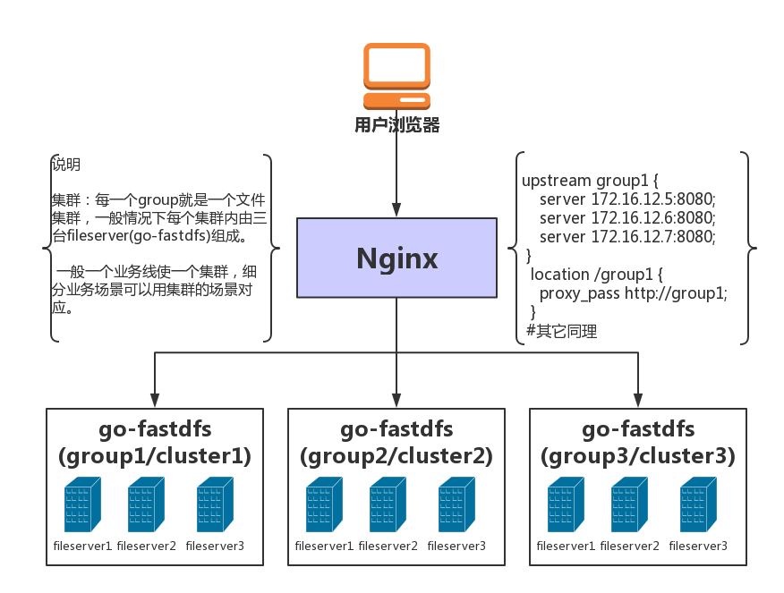

# [中文](README.md)  [English](README-en.md)


# go-fastdfs是一个基于http协议的分布式文件系统，它基于大道至简的设计理念，一切从简设计，使得它的运维及扩展变得更加简单，它具有高性能、高可靠、无中心、免维护等优点。

### 大家担心的是这么简单的文件系统，靠不靠谱，可不可以用于生产环境？答案是肯定的，正因为简单所以高效，因为简单所以稳定。如果你担心功能，那就跑单元测试，如果担心性能，那就跑压力测试，项目都自带了，跑一跑更放心^_^。

注意：使用前请认真阅读完本文，特别是[QA](#qa)

- 支持curl命令上传
- 支持浏览器上传
- 支持HTTP下载
- 支持多机自动同步
- 支持断点下载
- 支持配置自动生成
- 支持小文件自动合并(减少inode占用)
- 支持秒传
- 支持一键迁移
- 支持并行体验
- 支持断点续传([tus](https://tus.io/))
- 支持docker部署
- 支持自监控告警
- 支持集群文件信息查看
- 使用通用HTTP协议
- 无需专用客户端（支持wget,curl等工具）
- 类fastdfs
- 高性能 （使用leveldb作为kv库）
- 高可靠（设计极其简单，使用成熟组件）
- 无中心设计(所有节点都可以同时读写)

# 优点

- 无依赖(单一文件）
- 自动同步
- 失败自动修复
- 按天分目录方便维护
- 支持不同的场景
- 文件自动去重
- 支持目录自定义
- 支持保留原文件名
- 支持自动生成唯一文件名
- 支持浏览器上传
- 支持查看集群文件信息
- 支持集群监控邮件告警
- 支持小文件自动合并(减少inode占用)
- 支持秒传
- 极低资源开销
- 支持断点续传([tus](https://tus.io/))
- 支持docker部署
- 支持一键迁移（从其他系统文件系统迁移过来）
- 支持并行体验（与现有的文件系统并行体验，确认OK再一键迁移）
- 支持token下载　token=md5(file_md5+timestamp)
- 运维简单，只有一个角色（不像fastdfs有三个角色Tracker Server,Storage Server,Client），配置自动生成
- 每个节点对等（简化运维）
- 所有节点都可以同时读写


# 启动服务器（已编译，[下载](https://github.com/sjqzhang/fastdfs/releases)极速体验，只需一分钟）

`./fileserver`


# 命令上传

`curl -F file=@http-index-fs http://10.1.xx.60:8080/upload` 	


# WEB上传（浏览器打开）

`http://yourserver ip:8080` 注意：不要使用127.0.0.1上传 	

# 代码上传(选项参阅浏览器上传)

## python版本:
```python
import requests
url = 'http://10.1.5.9:8080/upload'
files = {'file': open('report.xls', 'rb')}
options={'output':'json','path':'','scene':''} #参阅浏览器上传的选项
r = requests.post(url, files=files)
print(r.text)
```
## golang版本
```go
package main

import (
	"fmt"
	"github.com/astaxie/beego/httplib"
)

func main()  {
	var obj interface{}
	req:=httplib.Post("http://10.1.5.9:8080/upload")
	req.PostFile("file","path/to/file")
	req.Param("output","json")
	req.Param("scene","")
	req.Param("path","")
	req.ToJSON(&obj)
	fmt.Print(obj)
}
```
## java版本
依赖(这里使用了hutool工具包,更简便)
```xml
<dependency>
	<groupId>cn.hutool</groupId>
	<artifactId>hutool-all</artifactId>
	<version>4.4.3</version>
</dependency>
```
上传代码
```java
public static void main(String[] args) {
    //文件地址
    File file = new File("D:\\git\\2.jpg");
    //声明参数集合
    HashMap<String, Object> paramMap = new HashMap<>();
    //文件
    paramMap.put("file", file);
    //输出
    paramMap.put("output","json");
    //自定义路径
    paramMap.put("path","image");
    //场景
    paramMap.put("scene","image");
    //上传
    String result= HttpUtil.post("http://xxxxx:xxxx/upload", paramMap);
    //输出json结果
    System.out.println(result);
}
```
[更多语言请参考](doc/upload.md)

# 断点续传示例

## golang版本
```go
package main

import (
    "os"
    "fmt"
    "github.com/eventials/go-tus"
)

func main() {
    f, err := os.Open("100m")
    if err != nil {
        panic(err)
    }
    defer f.Close()
    // create the tus client.
    client, err := tus.NewClient("http://10.1.5.9:8080/big/upload/", nil)
    fmt.Println(err)
    // create an upload from a file.
    upload, err := tus.NewUploadFromFile(f)
    fmt.Println(err)
    // create the uploader.
    uploader, err := client.CreateUpload(upload)
    fmt.Println(err)
    // start the uploading process.
   fmt.Println( uploader.Upload())

}

````
[更多客户商请参考](https://github.com/tus)


部署图



# 有问题请[点击反馈](https://github.com/sjqzhang/go-fastdfs/issues/new)

# 重要说明
## 在issue中有很多实际使用的问题及回答（很多已关闭，请查看已关闭的issue）

## 项目从v1.1.8开始进入稳定状态

# 更新说明
## 从低版升给到高版本，可能存在配置项变动的情况，一定要注意使用新的版本时的配置项。如何获得新版本的配置项及说明？先备份旧的配置项（文件名不能为cfg.json），再运行新的版本，配置项就自动生成。然后再修改相应的配置项。

- v1.1.9 增加文件自动迁移功能，支持同名文件重复覆盖选项。

 # <span id="qa">Q&A</span>

- 最佳实战？
```
一、如果是海量存储，不要开启文件token认证功能，减少性能开消。
二、尽量用标准上传，上传后业务保存path，在业务用的时候再并接上域名（方便迁移扩展等）。
三、如果使用断点续传，上传后一定要用文件id置换成path存储（如何置换看ＱＡ/API文档），为后面访问减少性能开消。
四、尽量使用物理服务器部署，因为主要压力或性能来自于IO
总结：业务保存的文件的path,减少后期访问路径转换带来开消,文件访问权限由业务来完成，这样性能最好，通用性强（可直接其它web服务器）。

重要提醒：如果开启小文件合并功能，后期是无法删除小文件的。
上传结果说明
	Md5    string `json:"md5"`
	Path   string `json:"path"`
	Domain string `json:"domain"`
	Scene  string `json:"scene"`
请使用以上字段，其它是为了兼容老的线上系统添加的，以后有可能去掉。
```

- 有API文档么？
[API文档](doc/api.md)

- 在微信讨论群中大家都问到go-fastdfs性能怎样？
```
由于问的人太多，在这里统一回答。
go-fastdfs的文件定位与其它分布式系统不同，它的寻址是直接定位，不经过任何组件，所以可以近似时间复杂度为o(1)[文件路径定位]
基本没有性能损耗，项目中也附有压测脚本，大家可以自已进行压测，群里就不要太多讨论问题了，人多每次回复同样的问题
大家也会觉得这群无聊。
```


- 已经使用fastdfs存储的文件可以迁移到go fastdfs下么（其它迁移情况可按类似的方式处理，极速体验也用类似的方式）？
```
答案是可以的，你担心的问题是路径改变,go fastdfs为你考虑了这一点
步骤：
	一、下载最新版的go-fastdfs
	二、将原来的fastdfs文件目录复制到go-fastdfs的 files目录下(如果文件很多，可以逆向过来，将fileserver复制过去，但要保留fileserver的目录结构）
	三、将配置enable_migrate设为true
	注意：迁移过程中会扫描整下files目录下的所有文件，
	速度较慢，迁移完成后请将enable_migrate设为false

说明：go-fastdfs的目录是不能变动的，与同步机制相关，很多同学在群里问题，我的files目录能不能自定义，答案是否定的。
至于能不能用软链接的方式本人没有测试过，可以自行测试。

```

- 什么是集群，如何用Nginx管理多集群？
```
1、在go-fastdfs中，一个集群就是一个group。
2、请参阅部署图
注意：配置中的 support_group_manage 参数设为true时，所有的url中都自动添加组信息。
例如：http://10.1.5.9:8080/group/status
默认：http://10.1.5.9:8080/status
区别：多了group,对应配置中的 group 参数,这样主要是为了解决一个Nginx反向代理多个group(集群)
具体请参阅部署图

```


- 如何搭建集群？
```
一、先下载已编译的可执行文件（用最新版本）
二、运行可执行文件（生成配置）
三、修改配置
	peers：增加对端的http地址
	检查:
	host:自动生成是否正确
	peer_id:集群内是否唯一
四、重新运行服器
五、验证服务是否OK
```


- 适合海量存储吗？
```
答案：适合海量存储
```


- 还需要安装nginx么？
```
可以不安装，也可以选择安装
go fastdfs 本身就是一个高性能的web文件服务器。
```

- 能动态加载配置么？
```
答案：是可以的，但要更新到最新版本
步骤：
1）修改 conf/cfg.json 文件
2）访问 http://10.1.xx.60:8080/reload
3） 注意：每个节点都需要进行同样的操作
```


- 如何查看集群文件信息？
```
http://10.1.xx.60:8080/stat

如果出现文件统计出错怎么办？
请删除 data目录下的 stat.json文件 重启服务，请系统自动重新计算文件数。

或者调用
http://10.1.xx.60:8080/repair_stat

```
- 可靠性怎样，能用于生产环境么？
```
本项目已大规模用于生产环境，如担心不能满足
可以在使用前对其各项特性进行压力测试，有任何
问题可以直接提issue
```

- 如何后台运行程序？
```
请使用control 对程序进行后面运行，具体操作如下:
    一、 chmod +x control
    二、 确保control与fileserver在同一个目录
    三、 ./control start|stop|status #对和序进行启动，停止，查看状态等。 

```


- 能不能在一台机器部置多个服务端？
```
不能，在设计之初就已考虑到集群的高可用问题，为了保证集群的真正可用，必须为不同的ip,ip 不能用 127.0.0.1
错误　"peers": ["http://127.0.0.1:8080","http://127.0.0.1:8081","http://127.0.0.1:8082"]
正确　"peers": ["http://10.0.0.3:8080","http://10.0.0.4:8080","http://10.0.0.5:8080"]
```
- 文件不同步了怎么办？
```
正常情况下，集群会每小时自动同步修复文件。（性能较差，在海量情况下建议关闭自动修复）
那异常情况下怎么？
答案：手动同步（最好在低峰执行）
http://172.16.70.123:7080/sync?date=20190117&force=1 (说明：要在文件多的服务器上执行，相关于推送到别的服务器)
参数说明：date 表示同步那一天的数据　force　1.表示是否强制同步当天所有(性能差)，0.表示只同步失败的文件

不同步的情况：
1) 原来运行N台，现在突然加入一台变成N+1台
2）原来运行N台，某一台机器出现问题，变成N-1台

如果出现多天数据不一致怎么办？能一次同步所有吗？
答案是可以：(最好在低峰执行)
http://172.16.70.123:7080/repair?force=1

```

- 文件不同步会影响访问吗？
```
答案：不会影响，会在访问不到时，自动修复不同步的文件。
```

- 如何查看系统状态及说明？
```
http://172.16.70.123:7080/status
注意:（Fs.Peers是不带本机的，如果带有可能出问题）
本机为 Fs.Local
sts["Fs.ErrorSetSize"] = this.errorset.Cardinality()  这个会导致内存增加

```


- 如何编译(go1.9.2+)？
```
git clone https://github.com/sjqzhang/go-fastdfs.git
cd go-fastdfs
mv vendor src
pwd=`pwd`
GOPATH=$pwd go build -o fileserver fileserver.go
```

- 如何跑单元测试 (尽量在linux下进行)？
```

git clone https://github.com/sjqzhang/go-fastdfs.git
cd go-fastdfs
mv vendor src
pwd=`pwd`
GOPATH=$pwd go test -v fileserver.go fileserver_test.go

```


- 如何压测？
```
先用gen_file.py产生大量文件（注意如果要生成大文件，自已在内容中乘上一个大的数即可）
例如:
# -*- coding: utf-8 -*-
import os
j=0
for i in range(0,1000000):
    if i%1000==0:
        j=i
        os.system('mkdir %s'%(i))
    with open('%s/%s.txt'%(j,i),'w+') as f:
        f.write(str(i)*1024)
接着用benchmark.py进行压测
也可以多机同时进行压测，所有节点都是可以同时读写的
```

- 代码为什么写在一个文件中？
```
一、目前的代码还非常简单，没必要弄得太复杂。
二、个人理解模块化不是分开多个文件就表示模块化，大家可以用IDE去看一下代码结构，其实是已经模块化的。
```

- 支持断点下载？
```
答案：支持
curl wget 如何
wget -c http://10.1.5.9:8080/group1/default/20190128/16/10/2G
culr -C - http://10.1.5.9:8080/group1/default/20190128/16/10/2G
```

- Docker如何部署？
```
步骤：
方式一、
    一、构建镜像
    docker build . -t fastdfs
    二、运行容器（使用环境变量 GO_FASTDFS_DIR 指向存储目录。）
    docker run --name fastdfs -v /data/fastdfs_data:/data -e GO_FASTDFS_DIR=/data fastdfs 
方式二、
    一、拉取镜像
    docker pull sjqzhang/go-fastdfs
    二、运行容器
    docker run --name fastdfs -v /data/fastdfs_data:/data -e GO_FASTDFS_DIR=/data fastdfs 

```

- 大文件如何分块上传或断点续传？
```
一般的分块上传都要客户端支持，而语言的多样性，客户端难以维护，但分块上传的功能又有必要，为此提供一个简单的实现思路。
方案一、
借助linux split cat 实现分割与合并，具体查看 split 与　cat 帮助。
分割： split  -b 1M filename #按每个文1M
合并： cat  x* > filename #合并
方案二、
借助hjsplit
http://www.hjsplit.org/
具体自行实现
方案三、
建议用go实现hjsplit分割合并功，这样具有跨平台功能。（未实现，等你来....）
方案四、
使用内置的继点续传功能（使用protocol for resumable uploads协议，[详情](https://tus.io/)）
 注意：方案四、只能指定一个上传服务器，不支持同时写，并且上传的url有变化
 原上传url： http://10.1.5.9:8080/<group>/upload
 断点上传url： http://10.1.5.9:8080/<group>/big/upload/
 上传完成，再通过秒传接口，获取文件信息
```

- 如何秒传文件？
```
通过http get的方式访问上传接口
http://10.0.5.9:8080/upload?md5=filesum&output=json
参数说明：
md5=sum(file) 文件的摘要算法要与文件务器的算法一致（算法支持md5|sha1），如果是断点续传，可以使用文件的id，也就是urlolad后的id
output=json|text 返回的格式
 
```

- 集群如何规划及如何进行扩容？
```
建议在前期规划时，尽量采购大容量的机器作为存储服务器，如果要两个副本就用两台组成一个集群，如果要三个副本
就三台组成一个集群。（注意每台服务器最好配置保持一样，并且使用raid5磁盘阵列）

如果提高可用性，只要在现在的集群peers中加入新的机器，再对集群进行修复即可。
修复办法 http://172.16.70.123:7080/repair?force=1  （建议低峰变更）

如何扩容？
为简单可靠起见，直接搭建一个新集群即可（搭建就是启动./fileserver进程，设置一下peers的IP地址，三五分钟的事）
issue中chengyuansen同学向我提议使用增加扩容特性，我觉得对代码逻辑及运维都增加复杂度，暂时没有加入这特性。

```


- 访问限制问题
```
出于安全考虑,管理API只能在群集内部调用或者用127.0.0.1调用.
```


- 有问题请[点击反馈](https://github.com/sjqzhang/go-fastdfs/issues/new)
## 有问题请加群


## [捐赠](doc/pay.png)
